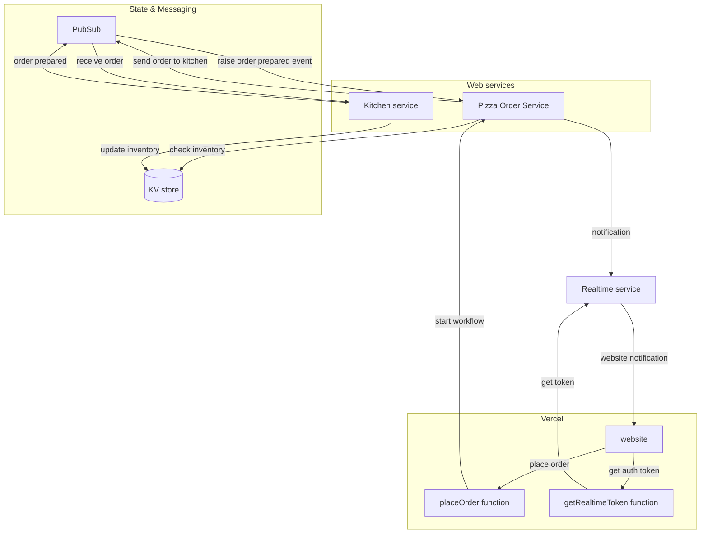

# Pizza Workflow Demo

```mermaid
graph TD

subgraph State & Messaging
	KV[(KV store)]
	PS[PubSub]
end

subgraph Web services
	KS[Kitchen service]
	WF[Pizza Order Service]
end

subgraph Vercel
	W[website]
	PF[placeOrder function]
	RF[getRealtimeToken function]
end

RTS[Realtime service]

W -->|place order| PF
W --> |get auth token| RF
RF ---->|get token| RTS
PF --> |start workflow|WF
WF-->|send order to kitchen|PS
WF-->|check inventory|KV
KS-->|update inventory|KV
PS-->|receive order|KS
WF---->|notification|RTS
KS-->|order prepared|PS
PS-->|raise order prepared event|WF
RTS ---->|website notification| W
```