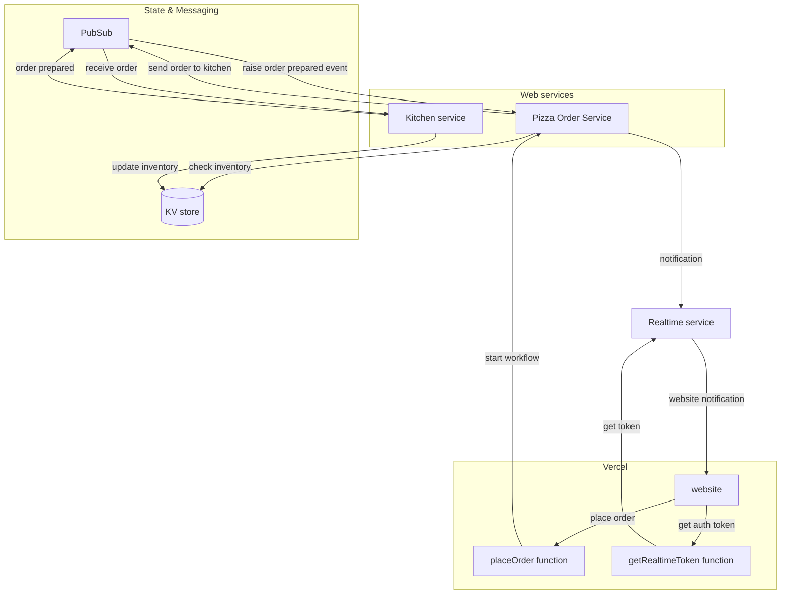

# Pizza Workflow Demo

This repository contains a solution that demonstrates how to use combine Dapr APIs for workflow,  pub/sub, and state management to build a distributed pizza ordering system.

The solution includes:

- [Vercel](https://vercel.com); to host the website (based on Vue) and two serverless functions (JavaScript).
- Two [Dapr](http://dapr.io) services written in .NET, _Pizza Order Service_ and _Kitchen Service_.
- [Ably](https://ably.com/); to provide realtime messaging between the website and backend Pizza Order Service.

The repo contains two variations:

1. The `local-dapr` branch runs the .NET services locally and uses Dapr in [self-hosted mode](https://docs.dapr.io/operations/hosting/self-hosted/self-hosted-overview/) using the Dapr CLI with multi-app-run.
2. Work in progress: The 'main' branch runs the .NET services on Google Cloud Run and uses a managed version of the Dapr API provided by [Diagrid Catalyst](https://www.diagrid.io/catalyst).

