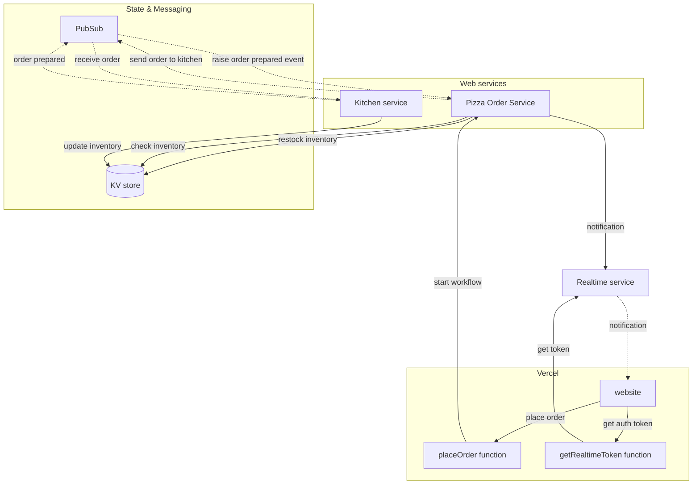

# Pizza Workflow Demo


This repository contains a solution that demonstrates how to use combine Dapr APIs for workflow,  pub/sub, and state management to build a distributed pizza ordering system.

The solution includes:

- [Vercel](https://vercel.com); to host the website (based on Vue) and two serverless functions (JavaScript).
- Two [Dapr](http://dapr.io) services written in .NET, _Pizza Order Service_ and _Kitchen Service_.
- [Ably](https://ably.com/); to provide realtime communication between the website and backend Pizza Order   Service.



The repo contains two variations:

1. The [`local-dapr` branch](https://github.com/diagrid-labs/catalyst-pizza-demo/tree/local-dapr) runs the .NET services locally and uses Dapr in [self-hosted mode](https://docs.dapr.io/operations/hosting/self-hosted/self-hosted-overview/) using the Dapr CLI with multi-app-run.
2. The ['main' branch](https://github.com/diagrid-labs/catalyst-pizza-demo/tree/main) runs the .NET services locally and uses a managed version of the Dapr API provided by [Diagrid Catalyst](https://www.diagrid.io/catalyst).

## Running the Diagrid Catalyst variation locally

### Prerequisites

- [Diagrid Catalyst account](https://catalyst.diagrid.io/) and the [Diagrid CLI](https://docs.dapr.io/getting-started/install-dapr-cli/)
- [Ably account (free)](https://www.ably.com/signup)
- [Vercel account (hobby)](https://vercel.com/signup) and the [Vercel CLI](https://vercel.com/docs/cli)

### Setup

1. [Fork](https://github.com/diagrid-labs/catalyst-pizza-demo/fork) this repo and clone it locally.
2. Using the [Ably portal](https://ably.com/accounts/): copy the [root API key](https://ably.com/docs/ids-and-keys#api-key) from the default Ably app.
3. Create a new Vercel project and import the forked repo.
   - Vercel should pickup the correct build & development default settings (based on Vite).
   - The root directory for the project should be `front-end`.
4. Go to the *Settings* tab for the Vercel project and add two environment variables:
   - `ABLY_API_KEY` - paste the Ably API key obtained from the Ably portal.
   - `WORKFLOW_URL` - `http://localhost:5064/workflow/orderReceived`.

### Catalyst

1. Open a terminal in the root of the repository and use the Diagrid CLI to login to Diagrid:

   ```bash
   diagrid login
   ```

1. Create a new Catalyst project named `catalyst-pizza-project` and use the Diagrid managed PubSub broker & KV store, and enable the managed workflow API:

	```bash
	diagrid proejct create catalyst-pizza-project --deploy-managed-pubsub --deploy-managed-kv --enable-managed-workflow --wait
	```

1. To set this project as the default in the CLI run:

	```bash
	diagrid project use catalyst-pizza-project
	```

1. Create a new App ID for the *PizzaOrderService*:

	```bash
	diagrid appid create pizzaorderservice
	```
 
1. Create a new App ID for the *KitchenService*:

	```bash
	diagrid appid create kitchenservice
	```

1. before continuing check the App IDs to make sure they have been created:

	```bash
	diagrid appid list
	```

1. Create a pub/sub subscription for the *KitchenService* to receive messages from the *PizzaOrderService*:

	```bash
	diagrid subscription create pizzaorderssub --connection pubsub --topic pizza-orders --route /prepare --scopes kitchenservice
	```

1. Create a pub/sub subscription for the *PizzaOrderService* to receive messages from the *KitchenService*:

	```bash
	diagrid subscription create preparedorderssub --connection pubsub --topic prepared-orders --route /workflow/orderPrepared --scopes pizzaorderservice
	```

1. Verify that creation of the subscriptions is completed:

	```bash
	diagrid subscription list
	```

1. Run `diagrid dev scaffold` to create a new local dev environment file . This creates a yaml file, named *dev-\<PROJECT NAME\>.yaml* with the following content:

	```yaml
	project: catalyst-pizza-project
	apps:
	- appId: kitchenservice
	appPort: 0
	env:
		DAPR_API_TOKEN: diagrid://<dapr_api_token>
		DAPR_APP_ID: kitchenservice
		DAPR_GRPC_ENDPOINT: https://<grpc_endpoint>
		DAPR_HTTP_ENDPOINT: https://<http_endpoint>
	workDir: kitchenservice
	command: []
	- appId: pizzaorderservice
	appPort: 0
	env:
		DAPR_API_TOKEN: diagrid://<dapr_api_token>
		DAPR_APP_ID: pizzaorderservice
		DAPR_GRPC_ENDPOINT: https://<grpc_endpoint>
		DAPR_HTTP_ENDPOINT: https://<http_endpoint>
	workDir: pizzaorderservice
	command: []
	appLogDestination: ""
	```

1. Update the `appPort` for the *kitchenservice* to `5066`
1. Update the `appPort` for the *pizzaorderservice* to `5064`.
1. Update the `command` arguments to `["dotnet", "run"]` for both apps.
1.  Update the `workDir` argument to point to `back-end/KitchenService` and `back-end/PizzaOrderService` respectively.
1.  Update the `appLogDestination` to `console`.
1.  Add an `ABLY_API_KEY` environment variable for the *pizzaorderservice* app and set the value to the Ably API key obtained from the Ably portal.

### Running the solution

1. Open a terminal in the root of the repository.
1. To restore and build the dotnet project run:

   ```bash
   dotnet build dotnet build ./back-end/PizzaOrderService
   dotnet build dotnet build ./back-end/KitchenService
   ```
1. Run `diagrid dev start` to start the `PizzaOrderService` and the `KitchenService`.
1. Open another terminal in the *front-end* folder of the repository.
1. To restore the npm packages run:

   ```bash
   npm install
   ```

1. Back in the root of the repository run `vercel dev` to start the website and the serverless functions (`getAblyToken` and `placeOrder`) locally.
1. Navigate to the URL provided by the Vercel CLI to view the website.
1. Select some pizzas, place an order, and watch the progress of the workflow in realtime.


## More information

Any questions or comments about this sample? Join the [Diagrid Community on Discourse](https://community.diagrid.io/invites/fAUrdyBbie) and post a message the *Catalyst* category.
Have you made something with Catalyst? Post a message in the *Built with Catalyst* category, we love to see your creations!
