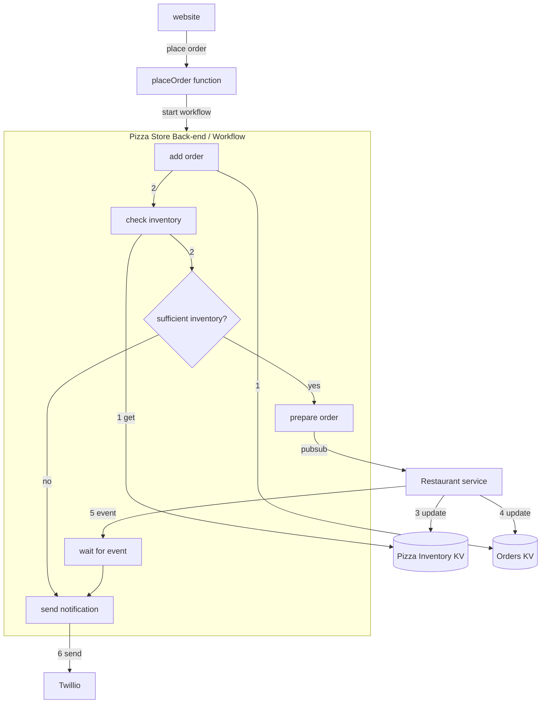

# diagrid-cloud-demo

```mermaid
graph TD
W[website]
F[placeOrder function]
IKV[(Pizza Inventory KV)]
OKV[(Orders KV)]
R[Restaurant service]
TW[Twillio]
W -->|place order| F
F --> |start workflow|pizza-store
subgraph pizza-store[Pizza Store Back-end / Workflow]
	WFAdd[add order]
	WFA[check inventory]
	Check{sufficient inventory?}
	WFB[prepare order]
	WFC[send notification]
	WFE[wait for event]
end
WFAdd -->|1| OKV
WFAdd -->|2| WFA
WFA -->|2| Check 
Check -->|yes| WFB
Check -->|no| WFC
WFA -->|1 get| IKV
WFE --> WFC
WFB -->|pubsub| R
R -->|3 update| IKV
R -->|4 update| OKV
R -->|5 event| WFE
WFC -->|6 send| TW
```