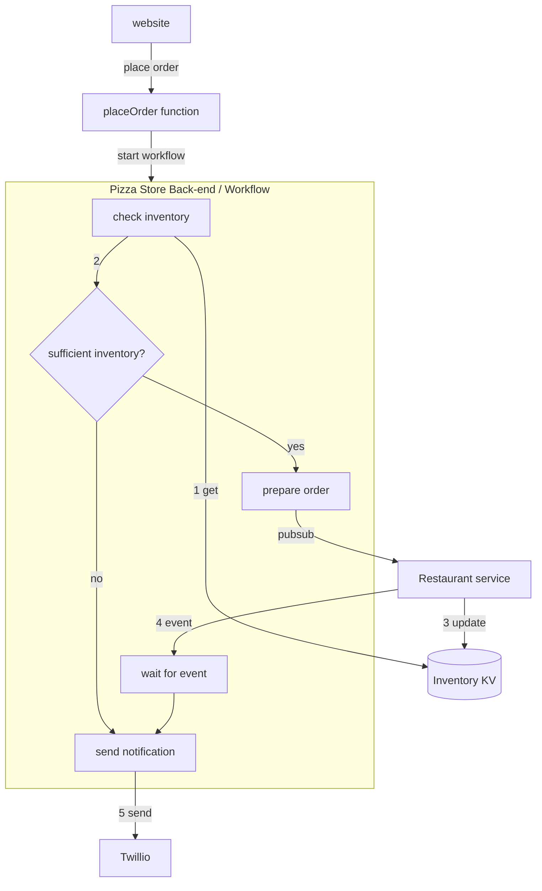

# diagrid-cloud-demo

```mermaid
graph TD
W[website]
F[placeOrder function]
KV[(Inventory KV)]
R[Restaurant service]
TW[Twillio]
W -->|place order| F
F --> |start workflow|pizza-store
subgraph pizza-store[Pizza Store Back-end / Workflow]
	WFA[check inventory]
	Check{sufficient inventory?}
	WFB[prepare order]
	WFC[send notification]
	WFE[wait for event]
end
WFA -->|2| Check 
Check -->|yes| WFB
Check -->|no| WFC
WFA -->|1 get| KV
WFE --> WFC
WFB -->|pubsub| R
R -->|3 update| KV
R -->|4 event| WFE
WFC -->|5 send| TW
```