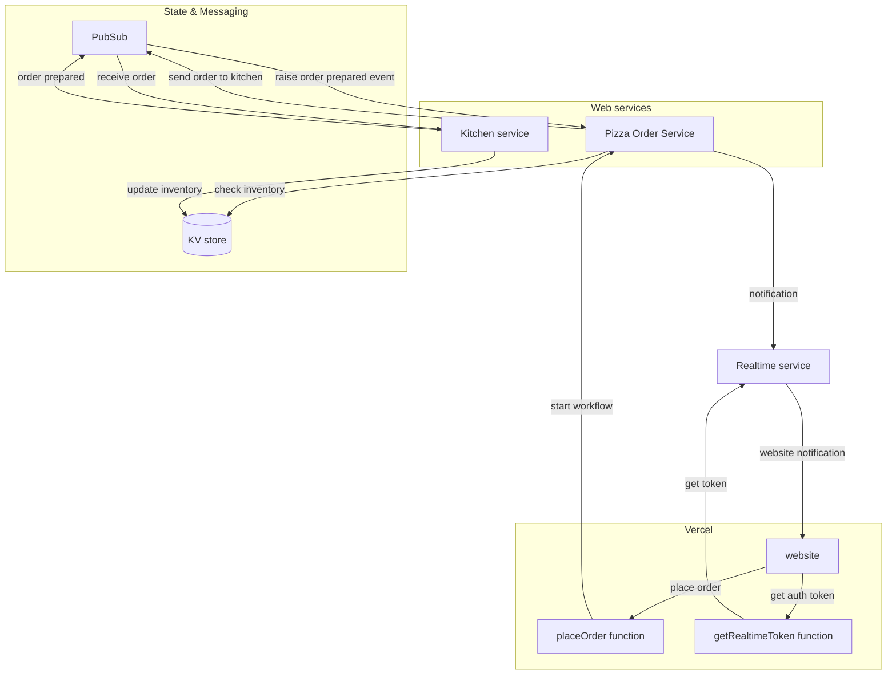

# Pizza Workflow Demo


This repository contains a solution that demonstrates how to use combine Dapr APIs for workflow,  pub/sub, and state management to build a distributed pizza ordering system.

The solution includes:

- [Vercel](https://vercel.com); to host the website (based on Vue) and two serverless functions (JavaScript).
- Two [Dapr](http://dapr.io) services written in .NET, _Pizza Order Service_ and _Kitchen Service_.
- [Ably](https://ably.com/); to provide realtime communication between the website and backend Pizza Order   Service.



The repo contains two variations:

1. The [`local-dapr` branch](https://github.com/diagrid-labs/catalyst-pizza-demo/tree/local-dapr) runs the .NET services locally and uses Dapr in [self-hosted mode](https://docs.dapr.io/operations/hosting/self-hosted/self-hosted-overview/) using the Dapr CLI with multi-app-run.
2. The ['main' branch](https://github.com/diagrid-labs/catalyst-pizza-demo/tree/main) runs the .NET services locally and uses a managed version of the Dapr API provided by [Diagrid Catalyst](https://www.diagrid.io/catalyst).

## Running the `main` variation locally

### Prerequisites

- [Diagrid Catalyst account](https://catalyst.diagrid.io/) and the [Diagrid CLI](https://docs.dapr.io/getting-started/install-dapr-cli/)
- [Ably account (free)](https://www.ably.com/signup)
- [Vercel account (hobby)](https://vercel.com/signup) and the [Vercel CLI](https://vercel.com/docs/cli)

### Setup

1. [Fork](https://github.com/diagrid-labs/catalyst-pizza-demo/fork) this repo and clone it locally.
2. Using the [Ably portal](https://ably.com/accounts/): copy the [root API key](https://ably.com/docs/ids-and-keys#api-key) from the default Ably app.
3. Create a new Vercel project and import the forked repo.
   - Vercel should pickup the correct build & development default settings (based on Vite).
   - The root directory for the project should be `front-end`.
4. Go to the *Settings* tab for the Vercel project and add two environment variables:
   - `ABLY_API_KEY` - paste the Ably API key obtained from the Ably portal.
   - `WORKFLOW_URL` - `http://localhost:5064/workflow/orderReceived`.

### Catalyst

1. Log into [Diagrid Catalyst](https://catalyst.diagrid.io/) and create a new Catalyst project: `catalyst-pizza-project`.
2. Create a new App ID for the *PizzaOrderService*: `pizzaorderservice`.
3. Create a new App ID for the *KitchenService*: `kitchenservice`.
4. Using the terminal run `diagrid login` and follow the instructions to login to Diagrid.
5. Run `diagrid dev scaffold` to create a new local dev environment file . This creates a yaml file, named *dev-\<PROJECT NAME\>.yaml* with the following content:

	```yaml
	project: catalyst-pizza-project
	apps:
	- appId: kitchenservice
	appPort: 0
	env:
		DAPR_API_TOKEN: diagrid://<dapr_api_token>
		DAPR_APP_ID: kitchenservice
		DAPR_GRPC_ENDPOINT: https://<grpc_endpoint>
		DAPR_HTTP_ENDPOINT: https://<http_endpoint>
	workDir: kitchenservice
	command: []
	- appId: pizzaorderservice
	appPort: 0
	env:
		DAPR_API_TOKEN: diagrid://<dapr_api_token>
		DAPR_APP_ID: pizzaorderservice
		DAPR_GRPC_ENDPOINT: https://<grpc_endpoint>
		DAPR_HTTP_ENDPOINT: https://<http_endpoint>
	workDir: pizzaorderservice
	command: []
	appLogDestination: ""
	```

6. Update the `command` arguments to be `["dotnet", "run"]` for both apps.
7. Update the `workDir` argument to point to `back-end/KitchenService` and `back-end/PizzaOrderService` respectively.
8. Update the `appLogDestination` to be `console`.
9. Add an `ABLY_API_KEY` environment variable for the pizzaorderservoce app and set the value to the Ably API key obtained from the Ably portal.
10. Create a Diagrid pub/sub topic that both services can use:
   1. Go to Pub/Sub Subscriptions.
   2. Select Create Subscription and use the following settings:
	  1. Subscription name: `pizzasubscription`
	  2. Pub/Sub connection: `pubsub`
	  3. Scopes: `kitchenservice, pizzaorderservice`
	  4. Topic: `pizza-orders`
	  5. Dead letter topic: *leave empty*
	  6. Default route: `/prepare`
   3. Select *Create Subscription*.

### Running the solution

1. Open a terminal and navigate to the root of the repository.
2. Run `diagrid dev start -f .\dev-catalyst-pizza-project.yaml` to start the `PizzaOrderService` and the `KitchenService`.
3. Make an POST request to the PizzaOrderService to restock the inventory with 20 pizzas for each of the 4 types of pizza:

   ```http
   POST http://localhost:5064/inventory/restock
   ```

   - You can verify the inventory by making a GET request to the inventory endpoint:

   ```http
   GET http://localhost:5064/inventory
   ```

4. Open another terminal and navigate to the root folder of the repo.
5. Run `vercel dev` to start the website and the serverless functions (`getAblyToken` and `placeOrder`) locally.
6. Navigate to the URL provided by the Vercel CLI to view the website.
7. Select some pizzas, place an order, and watch the progress of the workflow in realtime.


## More information

Any questions or comments about this sample? Join the [Diagrid Community on Discourse](https://community.diagrid.io/invites/fAUrdyBbie) and post a message the *Catalyst* category.
Have you made something with Catalyst? Post a message in the *Built with Catalyst* category, we love to see your creations!
